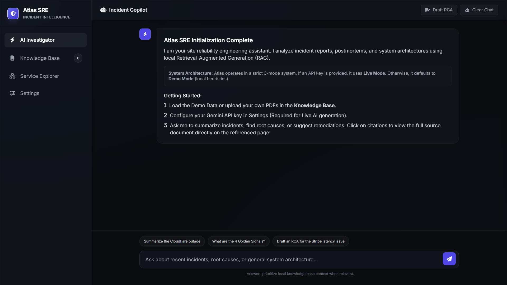

<div align="center">

# 🌐 ATLAS SRE

**AI-Powered Engineering Incident Intelligence System**

[]()
[]()
[]()
[]()

*Reducing Mean Time to Resolution (MTTR) with a zero-backend, privacy-first copilot for incident response, root cause analysis, and architecture exploration.*

[Live Demo](#) <!-- Placeholder for [Live Demo Link] -->
<br>


[Features](#-core-modules--features) • [How it Works](#-technical-architecture) • [Evaluation Guide](#-step-by-step-evaluation-guide) • [Roadmap](#-blueprint-roadmap)

</div>

---

## 🛑 The Problem

During a critical Sev-1 incident, Mean Time to Resolution (MTTR) is everything. Site Reliability Engineers (SREs) and DevOps teams often waste precious minutes frantically searching through fragmented PDFs, historical postmortems, and outdated runbooks. 

Existing AI solutions attempt to solve this but introduce a massive risk: they require uploading highly sensitive infrastructure documents, security policies, and proprietary architecture diagrams to third-party centralized vector clouds. This creates severe security and compliance bottlenecks, effectively making them unusable for secure enterprise environments.

## 💡 The Solution

**Atlas SRE** is a radically different approach to incident intelligence. It is a completely self-contained web application that runs a **Retrieval-Augmented Generation (RAG) pipeline entirely inside your browser**. 

By parsing and processing PDFs locally in the client and utilizing the **Google Gemini 3.5 Flash/Pro API** solely for context-aware generation, Atlas eliminates the need for backend vector databases. Your documents stay on your machine, queries are resolved instantly, and teams can explore their infrastructure documentation securely without deploying a single backend server.

---

## ✨ Core Modules & Features

| 🚀 Module | 🔍 Description |
| :--- | :--- |
| **Zero-Backend Client-Side RAG** | Document chunking, TF-IDF lexical indexing, and local keyword overlap scoring happen completely in the browser without a backend vector cloud. Your sensitive data stays local. |
| **AI Investigator (Incident Copilot)** | A chat assistant utilizing **Gemini 3.5 Flash/Pro** for context-aware synthesis. Features instant action macros (e.g., "Draft RCA") and a **RAG Transparency Log** exposing retrieval scores, chunks used, and confidence estimates. |
| **Interactive PDF Citation Engine** | Powered by PDF.js for localized text extraction and high-fidelity canvas rendering. Includes clickable citation chips that anchor directly back to specific pages in the original documents. |
| **Knowledge Base Management** | Drag-and-drop PDF ingestion, live metrics for chunks/documents, and a preloaded 18-document **"Demo Knowledge Base"** (covering SLOs, Outages, etc.) for instant testing and evaluation. |
| **Service Explorer** | An automated operational dependency mapper that parses uploaded architecture docs and visualizes relationships between services (e.g., Redis, PostgreSQL, Kafka) using an ASCII-style tree topology. |
| **System Settings Configuration** | Fine-grained user control over the live LLM parameters, including Model selection (Gemini 3.5 Flash/Pro), Retrieval Top-K, and LLM Temperature. |

---

## 🏗 Technical Architecture

Atlas SRE proves that powerful, secure AI tools can be built with modern vanilla web technologies, prioritizing extreme speed, absolute privacy, and deployment simplicity.

### 🛠 Tech Stack
* **UI & Styling:** Tailwind CSS, FontAwesome for a responsive, modern glassmorphism interface.
* **Document Engine:** PDF.js (Mozilla) handles binary parsing, text layer extraction, and high-fidelity canvas rendering natively.
* **Retrieval Logic:** Vanilla JavaScript executes client-side TF-IDF overlap evaluation, chunking, and lexical indexing entirely in memory.
* **LLM Integration:** Google Gemini API provides advanced reasoning, summarization, and formatting based strictly on the retrieved local context window.
* **Formatting & Security:** Marked.js, DOMPurify, and Highlight.js safely render AI-generated Markdown with syntax highlighting.

### 🔄 Data Flow
1. **Ingestion:** Text layer extraction is performed locally via PDF.js Web Workers.
2. **Indexing:** The text is chunked and mathematically indexed in the browser's memory using TF-IDF style heuristics.
3. **Retrieval:** Local keyword overlap scoring fetches the highest relevance document chunks based on user queries.
4. **Generation:** Chunks are sent to Gemini 3.5 Flash/Pro to synthesize a response with precise citation anchoring.

---

## 🚀 Step-by-Step Evaluation Guide

Atlas SRE is designed for immediate evaluation by project reviewers and engineers. There are no databases to spin up, no Node modules to install, and no Docker containers to build.

### Prerequisites
* A modern web browser (Chrome, Edge, Firefox, Safari).
* A free [Google Gemini API Key](https://aistudio.google.com/app/apikey).

### 1. Local Installation & Launch
First, clone the repository or download the source code:
```bash
git clone https://github.com/yourusername/atlas-sre.git
cd atlas-sre
```

Because PDF.js utilizes Web Workers for parsing, you must serve the files via a local web server to bypass CORS restrictions:
* **Python:** `python -m http.server 8000`
* **Node.js:** `npx serve`
* **VS Code:** Right-click `index.html` and select "Open with Live Server".

Navigate to `http://localhost:8000` in your browser.

### 2. Enter Workspace & Load Demo Data
1. On the landing page, click **Enter Workspace**.
2. At the top of the screen, you will see a global **Demo Mode** banner.
3. Click **Load Demo Knowledge Base** to instantly ingest the pre-packaged dataset of 18 SRE documents (SLOs, past outages, runbooks).

### 3. Configure the AI Engine
1. Click **Settings** in the bottom-left sidebar.
2. Paste your Gemini API Key.
3. Select **Gemini 3.5 Flash** or **Gemini 3.5 Pro**.
4. Adjust Retrieval Top-K and Temperature if desired, then click **Save Configuration**.

### 4. Issue Queries
Navigate to the **AI Investigator** (chat interface) and try the built-in macros or ask:
* *"Based on the recent context, draft a structured SRE Blameless Postmortem for the cache stampede."*
* *"What is the dependency chain for the payment gateway according to the architecture docs?"*

Observe the **RAG Transparency Log** and click on the generated **Citation Chips** to instantly render the corresponding PDF page.

---

## 🗺 Blueprint Roadmap

* [ ] **IndexedDB Support:** Move document storage from volatile memory to persistent browser storage so PDFs remain available between sessions.
* [ ] **Semantic WebGL Embeddings:** Upgrade from lexical search to semantic search using lightweight, browser-based embedding models (like Transformers.js) locally.
* [ ] **Automated Service Map Generation:** Enhance the Service Explorer to dynamically draw node-based architecture diagrams from text context using D3.js.
* [ ] **Exportable Workspaces:** Allow teams to download their processed knowledge base as a single encrypted JSON payload to share securely during live incidents.

---

## 📄 License

Distributed under the MIT License. See `LICENSE` for more information.

---
<div align="center">
  <p>Built with 🩵 by <a href="https://github.com/codedByBurhan">codedByBurhan</a>.</p>
</div>
